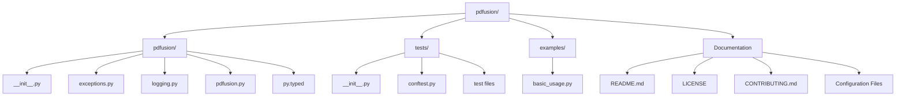
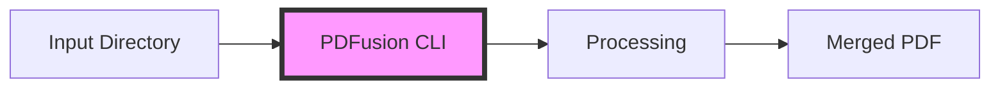

# 📄 PDFusion

A lightweight Python utility for effortlessly merging multiple PDF files into a single document.

[](https://choosealicense.com/licenses/mit/)
[](https://www.python.org/downloads/release/python-3110/)
[](CONTRIBUTING.md)
[](https://github.com/BjornMelin)
[](https://www.linkedin.com/in/bjorn-melin/)
[](https://github.com/psf/black)
[](https://github.com/astral-sh/ruff)

## 📋 Table of Contents

- [📝 Description](#-description)
  - [🚀 Key Features](#-key-features)
- [📂 Repository Structure](#-repository-structure)
- [💻 Installation](#-installation)
  - [For Users 🌟](#for-users-)
  - [For Developers 🔧](#for-developers-)
- [🎮 Usage](#-usage)
  - [Command Line Interface](#command-line-interface)
  - [Python API](#python-api)
- [🛠️ Development](#️-development)
  - [Running Tests](#running-tests)
- [🤝 Contributing](#-contributing)
- [👨‍💻 Author](#-author)
- [📜 License](#-license)
- [🌟 Star History](#-star-history)
- [🙏 Acknowledgments](#-acknowledgments)

## 📝 Description

PDFusion is a simple yet powerful command-line tool that makes it easy to combine multiple PDF files into a single document while preserving the original quality. Perfect for combining reports, consolidating documentation, or organizing digital paperwork.

### 🚀 Key Features

- 📁 Merge all PDFs in a directory with a single command
- 🔄 Automatic alphabetical ordering of files
- ⏱️ Timestamp-based output naming option
- 🛠️ Both CLI and Python API support
- 💡 Clear progress feedback and error handling
- 🔒 Maintains original PDF quality
- 📝 Detailed logging of the merge process
- 🔍 Type hints with full mypy support
- 🧪 Comprehensive test coverage (>90%)
- 📊 Performance benchmarks included
- 🐛 Custom exception handling
- 🎯 Supports Python 3.11+

## 📂 Repository Structure



## 💻 Installation

### For Users 🌟

```bash
pip install pdfusion
```

### For Developers 🔧


1. Clone the repository:

    ```bash
    git clone https://github.com/BjornMelin/pdfusion.git
    cd pdfusion
    ```

2. Create a virtual environment:

    ```bash
    python -m venv venv
    source venv/bin/activate  # On Windows: .\venv\Scripts\activate
    ```

    > **Note:** You can also use `virtualenv` instead of `venv`. See the [Virtual Environment Setup Guide](docs/virtualenv-setup.md) for more details.

3. Install development dependencies:

    ```bash
    pip install -r requirements-dev.txt
    ```

## 🎮 Usage

### Command Line Interface



```bash
# Basic usage
pdfusion /path/to/pdfs -o merged.pdf

# With verbose output
pdfusion /path/to/pdfs -v

# Auto timestamp filename
pdfusion /path/to/pdfs
```

### Python API

```python
from pdfusion import merge_pdfs

# Basic usage
result = merge_pdfs("/path/to/pdfs", "output.pdf")
print(f"Merged {result.files_merged} files into {result.output_path}")

# With verbose output
result = merge_pdfs("/path/to/pdfs", verbose=True)
print(f"Total pages in merged PDF: {result.total_pages}")
```

## 🛠️ Development

### Running Tests

```bash
# Run all tests
pytest

# Run with coverage report
pytest --cov=pdfusion

# Run performance benchmarks
pytest tests/test_pdfusion.py -v -m benchmark

# Run specific test file
pytest tests/test_pdfusion.py -v
```

## 🤝 Contributing


1. Fork the repository
2. Create your feature branch (`git checkout -b feat/version/AmazingFeature`)
3. Commit your changes (`git commit -m 'type(scope): Add some AmazingFeature'`)
4. Push to the branch (`git push origin feat/version/AmazingFeature`)
5. Open a Pull Request (`feat(scope): Add some AmazingFeature`)

## 👨‍💻 Author

### Bjorn Melin

[](https://www.credly.com/org/amazon-web-services/badge/aws-certified-solutions-architect-associate)
[](https://www.credly.com/org/amazon-web-services/badge/aws-certified-developer-associate)
[](https://www.credly.com/org/amazon-web-services/badge/aws-certified-ai-practitioner)
[](https://www.credly.com/org/amazon-web-services/badge/aws-certified-cloud-practitioner)

AWS-certified Solutions Architect and Developer with expertise in cloud architecture and modern development practices. Connect with me on:

- 🌐 [GitHub](https://github.com/BjornMelin)
- 💼 [LinkedIn](https://www.linkedin.com/in/bjorn-melin/)

Project Link: [https://github.com/BjornMelin/pdfusion](https://github.com/BjornMelin/pdfusion)

## 📜 License

This project is licensed under the MIT License - see the [LICENSE](LICENSE) file for details.

## 🌟 Star History

[](https://star-history.com/#bjornmelin/pdfusion&Date)

## 🙏 Acknowledgments

- 🐍 [Python](https://www.python.org/)
- 📄 [pypdf2](https://pypdf.readthedocs.io/en/stable/)
- 🏷️ [GitHub Badges](https://shields.io/)

<div align="center">
    <h3>⚡ Built with Python 3.11 + pypdf2 by Bjorn Melin</h3>
</div>
